# Prática com Web Services RESTful

- Implementação em Java, utilizando o framework Spring Boot, de uma API de um serviço Web RESTful para automação residencial.

## Execução
- Clonar e acessar o diretório raiz:
   
  ```bash
  git clone https://github.com/STD29006-classroom/2025-02-lista-02-luizakuze
  cd 2025-02-lista-02-luizakuze
  ```
-  Executar o projeto:
  
    ```bash
    ./gradlew bootRun
    ```
- A documentação OpenAPI estará disponível em `http://localhost:8080/swagger-ui.html`.
- Prosseguir para a seção _**Demonstração com cURL e HTTP Status**_ para obter exemplos de requisições e respostas HTTP.


## API do serviço

### Rota `/dispositivos`

| Verbo | Recurso              | Corpo do pedido                             | Corpo da resposta                        | HTTP Status     |
| ----- | -------------------- | ------------------------------------------- | ---------------------------------------- | --------------- |
| GET   | `/dispositivos`      | x                                           | JSON com a lista de dispositivos         | 200             |
| GET   | `/dispositivos/{id}` | x                                           | JSON com o dispositivo do `id` informado | 200 ou 404      |
| PUT   | `/dispositivos/{id}` | JSON com os campos completos do dispositivo | JSON do dispositivo atualizado           | 200, 400 ou 404 |


### Rota `/ambientes`

| Verbo | Recurso           | Corpo do pedido                       | Corpo da resposta                                          | HTTP Status     |
| ----- | ----------------- | ------------------------------------- | ---------------------------------------------------------- | --------------- |
| GET   | `/ambientes`      | x                                     | JSON com a lista de ambientes (com seus dispositivos)      | 200             |
| GET   | `/ambientes/{id}` | x                                     | JSON do ambiente do `id` informado (com seus dispositivos) | 200 ou 404      |
| PUT   | `/ambientes/{id}` | JSON com tipo e lista de dispositivos | JSON do ambiente atualizado                                | 200, 400 ou 404 |


### Rota `/cenários`

| Verbo  | Recurso          | Corpo do pedido                   | Corpo da resposta                 | HTTP Status     |
| ------ | ---------------- | --------------------------------- | --------------------------------- | --------------- |
| GET    | `/cenarios`      | x                                 | JSON com a lista de cenários      | 200             |
| GET    | `/cenarios/{id}` | x                                 | JSON do cenário do `id` informado | 200 ou 404      |
| POST   | `/cenarios`      | JSON com os dados do novo cenário | JSON do cenário criado (com `id`) | 201             |
| PUT    | `/cenarios/{id}` | JSON com novos valores do cenário | JSON do cenário atualizado        | 200 ou 404      |
| PATCH  | `/cenarios/{id}` | x                                 | JSON da rotina aplicada           | 200, 400 ou 404 |
| DELETE | `/cenarios/{id}` | x                                 | JSON do cenário removido          | 200 ou 404      |


## Demonstração com cURL e HTTP Status

### Rota `/dispositivos`

#### 1. Listar dispositivos

> Por padrão, a aplicação já inicia com alguns dispositivos previamente cadastrados em memória.

> Para melhor visualização, foram ocultados alguns dispositivos na resposta. 

- **Requisição**

    ```bash
    curl --request GET \
  --url http://localhost:8080/dispositivos
    ```

- **Resposta esperada**
  - **HTTP 200 (OK)**, com a lista JSON contendo todos os dispositivos
    <p align="center">
    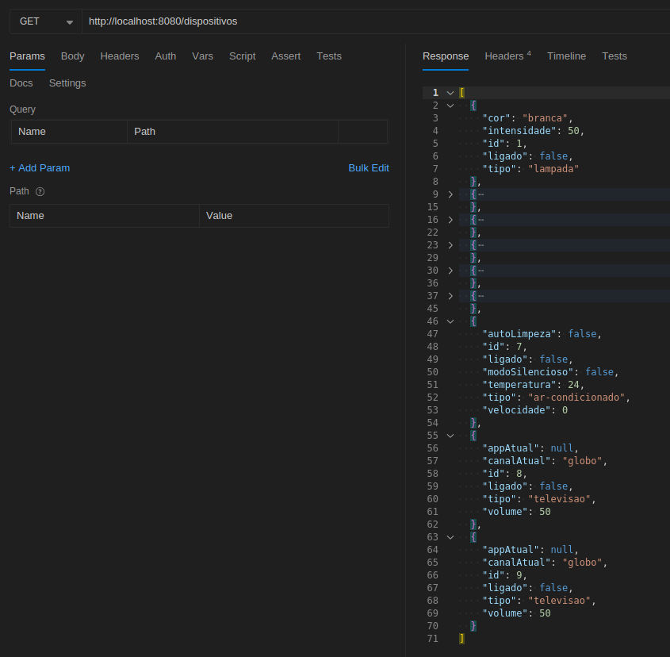
    </p>


#### 2. Obter dispositivo pelo ID

- **Requisição**

    ```bash
    curl --request GET \
  --url http://localhost:8080/dispositivos/1
    ```

- **Resposta esperada**
  - **HTTP 200 (OK)**, se o dispositivo existir 
    <p align="center">
    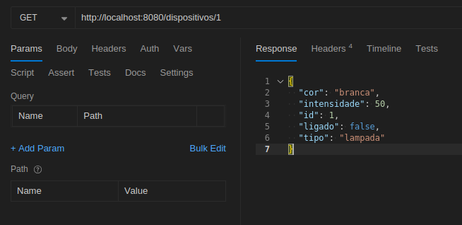
    </p>
  - **HTTP 404 (Not Found)**, caso contrário


#### 3. Atualizar um dispositivo 
> As cores das lâmpadas, bem como os canais e aplicativos da televisão, são definidos por enumerações no código. Acessar as classes para verificação dos valores possíveis.

- **Requisição**

    ```bash
    curl --request PUT \
    --url http://localhost:8080/dispositivos/1 \
    --header 'content-type: application/json' \
    --data '{
    "cor": "amarela",
    "intensidade": 20,
    "id": 1,
    "ligado": false,
    "tipo": "lampada"
    }'
    ```

- **Resposta esperada**
  - **HTTP 200 (OK)**, se o dispositivo for atualizado com sucesso, com o JSON do dispositivo atualizado  
    <p align="center">
    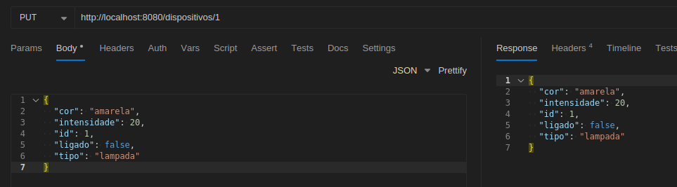
    </p>
  - **HTTP 400 (Bad Request)**, caso o formato da requisição seja inválido  
  - **HTTP 404 (Not Found)**, caso o dispositivo não seja encontrado  


### Rota `/ambientes`

> No projeto foram adotados 5 ambientes: **sala**, **cozinha**, **quarto**, **banheiro** e **lavanderia**.

#### 1. Listar todos os ambientes

Os ambientes iniciam sem nenhuma associação com dispositivos.

- **Requisição**
  
    ```bash
    curl --request GET \
  --url http://localhost:8080/ambientes
    ```

- **Resposta esperada**
  - **HTTP 200 (OK)**, com a lista JSON contendo todos os ambientes e seus dispositivos
    <p align="center">
    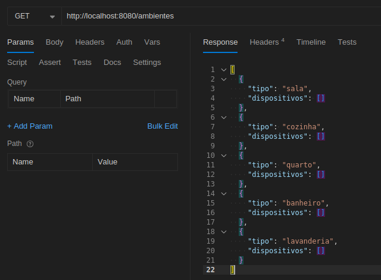
    </p>


#### 2. Adicionar/remover dispositivos no ambiente

A associação (e remoção) de dispositivos é feita via **PUT** do ambiente, enviando a lista completa de dispositivos que devem permanecer associados.

Exemplo: associar a lâmpada `id=1` e o ar-condicionado `id=7` ao ambiente **sala** (`id=1`).

- **Requisição**
    ```bash
    curl --request PUT \
    --url http://localhost:8080/ambientes/1 \
    --header 'content-type: application/json' \
    --data '{
    "tipo": "sala",
    "dispositivos": [
        {
        "id": 1,
        "tipo": "lampada",
        "ligado": false,
        "cor": "branca",
        "intensidade": 50
        },
        {
        "id": 7,
        "tipo": "ar-condicionado",
        "ligado": false,
        "temperatura": 24,
        "modoSilencioso": false
        }
    ]
    }'
    ```

- **Resposta esperada**
  - **HTTP 200 (OK)**, com o JSON do ambiente atualizado  
    <p align="center">
    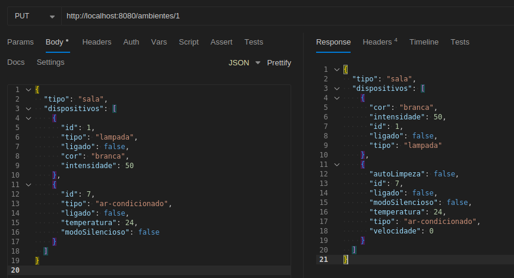
    </p>
  - **HTTP 400 (Bad Request)**, caso o corpo da requisição seja inválido  
  - **HTTP 404 (Not Found)**, caso o ambiente não seja encontrado  


#### 3. Listar novamente todos os ambientes

Agora é possível verificar que houve a associação dos dispositivos ao ambiente atualizado.

- **Requisição**
  
    ```bash
    curl --request GET \
    --url http://localhost:8080/ambientes
    ```

- **Resposta esperada**
  - **HTTP 200 (OK)**, com a lista JSON contendo todos os ambientes e seus dispositivos
    <p align="center">
    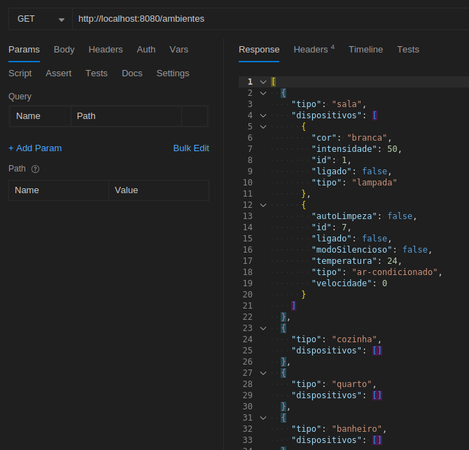
    </p>


### Rota `/cenarios`

#### 1. Criar o cenário "*Modo Cinema*"

Criação de um cenário que liga a televisão na Netflix e ajusta o ar-condicionado.

- **Requisição**
  
    ```bash
    curl --request POST \
    --url http://localhost:8080/cenarios \
    --header 'content-type: application/json' \
    --data '{
    "nome": "Modo Cinema",
    "rotina": [
        {
        "dispositivoId": 9,
        "ligado": true,
        "appAtual": "netflix",
        "volume": 50
        },
        {
        "dispositivoId": 7,
        "ligado": true,
        "temperatura": 24,
        "modoSilencioso": false,
        "velocidade": 0
        }
    ]
    }'
    ```

- **Resposta esperada**
  - **HTTP 201 (Created)**, com o JSON do cenário criado 
    <p align="center">
    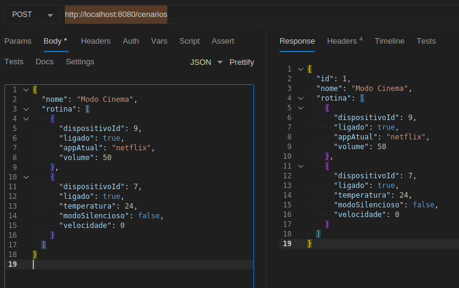
    </p>
  - **HTTP 400 (Bad Request)**, caso a rotina seja inválida ou o corpo da requisição esteja incorreto


#### 2. Criar o cenário "*Fim de Semana*"

Criação de um cenário que acende duas lâmpadas com cores e intensidades diferentes.

- **Requisição**
  
    ```bash
    curl --request POST \
    --url http://localhost:8080/cenarios \
    --header 'content-type: application/json' \
    --data '{
    "nome": "Fim de Semana",
    "rotina": [
        {
        "dispositivoId": 1,
        "ligado": true,
        "cor": "amarela",
        "intensidade": 70
        },
        {
        "dispositivoId": 2,
        "ligado": true,
        "cor": "branca",
        "intensidade": 50
        }
    ]
    }'
    ```

- **Resposta esperada**
  - **HTTP 201 (Created)**, com o JSON do cenário criado 
    <p align="center">
    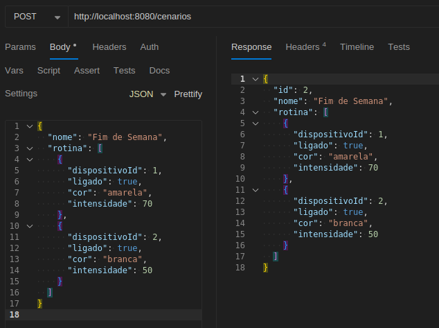
    </p>
  - **HTTP 400 (Bad Request)**, caso a rotina seja inválida ou o corpo da requisição esteja incorreto


#### 3. Verificar estado dos dispositivos antes de aplicar o cenário

Antes da execução do cenário "*Modo Cinema*", vamos realizar uma consulta do estado atual dos dispositivos cadastrados.

Nessa verificação, é possível observar os estados dos dispositivos de ID 7 e ID 9, que ainda não sofreram nenhuma alteração provocada pela aplicação do cenário.

- **Requisição**
  
    ```bash
    curl --request GET \
  --url http://localhost:8080/dispositivos
    ```

- **Resposta esperada**
  - **HTTP 200 (OK)**, com a lista JSON contendo o estado atual dos dispositivos
    <p align="center">
    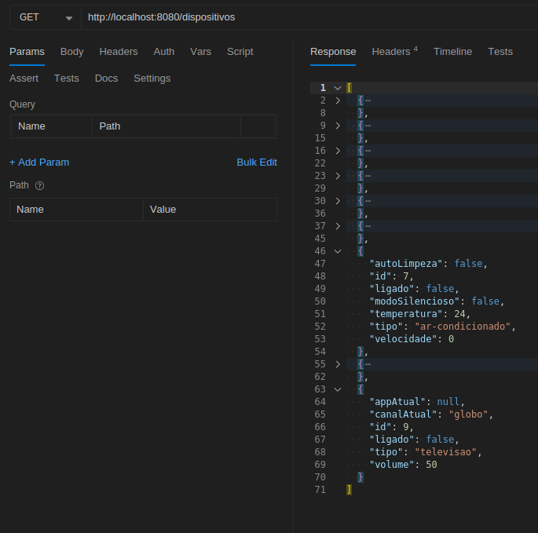
    </p>
 

#### 4. Aplicar o cenário "*Modo Cinema*"

É executada a rotina definida no cenário, alterando o estado dos dispositivos envolvidos.

- **Requisição**
  
    ```bash
    curl --request PATCH \
  --url http://localhost:8080/cenarios/1
    ```

- **Resposta esperada**
  - **HTTP 200 (OK)**, com o JSON da rotina aplicada
    <p align="center">
    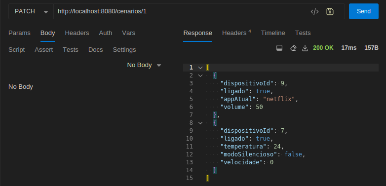
    </p>
  - **HTTP 400 (Bad Request)**, caso a rotina do cenário seja inválida
  - **HTTP 404 (Not Found)**, caso o cenário não seja encontrado
  - 
#### 5. Atualizar o cenário "*Fim de Semana*"

Atualização completa de um cenário existente, onde há a adição de um novo dispositivo no conjunto

- **Requisição**
  
  ```bash
  curl --request PUT \
    --url http://localhost:8080/cenarios/2 \
    --header 'content-type: application/json' \
    --data '{
    "nome": "Fim de Semana",
    "rotina": [
      {
        "dispositivoId": 1,
        "ligado": true,
        "cor": "rosa",
        "intensidade": 70
      },
      {
        "dispositivoId": 2,
        "ligado": true,
        "cor": "azul",
        "intensidade": 50
      },
      {
        "dispositivoId": 3,
        "ligado": true,
        "cor": "verde",
        "intensidade": 50
      }
    ]
  }'
  ```

- **Resposta esperada**
  - **HTTP 200 (OK)**, com o JSON do cenário atualizado
  <p align="center">
    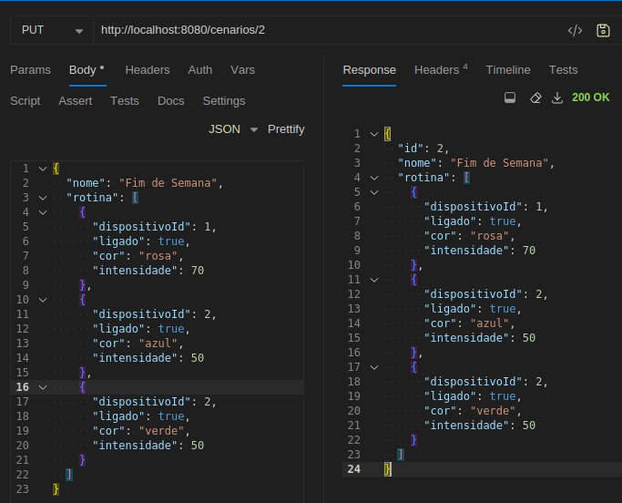
  </p>
  - **HTTP 404 (Not Found)**, caso o cenário não seja encontrado


#### 6. Listar todos os cenários cadastrados

- **Requisição**
    
    ```bash
    curl --request GET \
  --url http://localhost:8080/cenarios
    ```

- **Resposta esperada**
  - **HTTP 200 (OK)**, com um JSON contendo todos os cenários cadastrados
    <p align="center">
      
    </p>

#### 7. Remover o cenário "*Modo Cinema*"

- **Requisição**
    
    ```bash
   curl --request DELETE \
  --url http://localhost:8080/cenarios/1
    ```

- **Resposta esperada**
  - **HTTP 200 (OK)**, com o JSON do cenário removido
    <p align="center">
      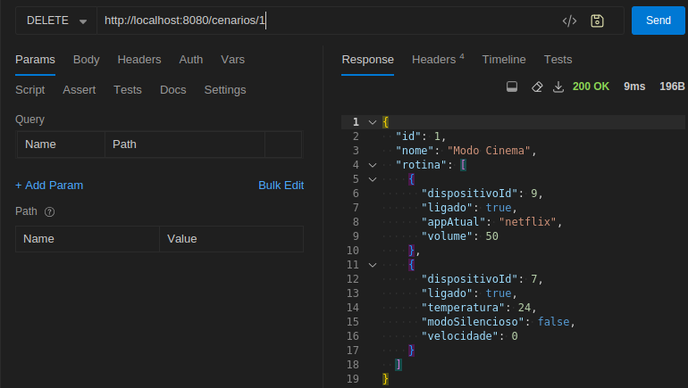
    </p>
  - **HTTP 404 (Not Found)**, caso o cenário não seja encontrado